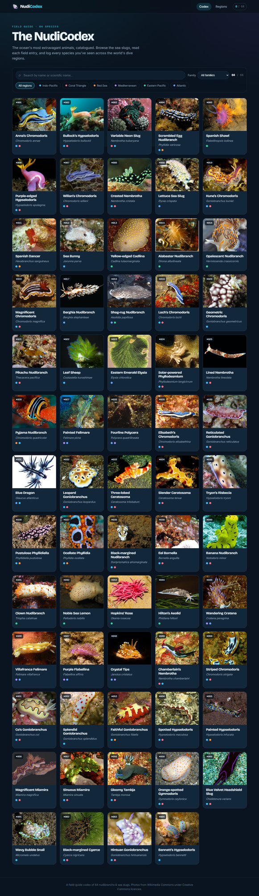

# NudiCodex

A "Pokédex" for nudibranchs and sea slugs. Browse a catalogue of the ocean's most
extravagant animals, read a clean field entry for each one, and track how many
species you've logged across the world's dive regions.



## What it does

- **Codex grid** — every species as a numbered card with its photo, names and region tags.
- **Search & filter** — instant text search plus filters by taxonomic family and ocean region.
- **Species entries** — each entry has a specimen readout (size, depth, water temperature,
  order), taxonomy, "how to identify" field marks, habitat, diet, distribution and a fun fact.
- **One-tap logging** — tick any species straight from its grid card (no need to open the
  page); it's recorded against the species' main region, which you can refine on the detail page.
- **Region tracker** — mark a species as seen and record which region you saw it in. A
  progress page shows per-region completion and your overall codex percentage.
- **Achievements** — nineteen milestone badges that unlock as you collect: count goals
  (1/5/10/25/50/75/all logged), region goals (a sighting in every region, completing one or every
  region), taxonomy goals (all three orders, 12 and 20 families, 10 chromodorids), and trait goals
  (a giant, a tiny species, a deep-water one, a sacoglossan, a cold-water one).
- **Favourites & bucket-list** — heart the species you love and star the ones you want to see,
  from the grid card or the detail page.
- **Accounts & profile** *(optional)* — sign up to save your collection to the cloud and sync it
  across devices. Your profile shows metrics and graphs: sightings over time, a breakdown by
  order, per-region progress, and your favourites and bucket-list galleries.
- **Offline-first** — ships with a curated 127-species dataset and needs no backend to run. Guests
  keep their collection in the browser (localStorage); signing in merges it into the account.

## Tech stack

React 18 · TypeScript (strict) · Vite · React Router · TanStack Query · Zustand · Recharts ·
Supabase (auth + Postgres, optional).

## Quick start

```bash
cd frontend
npm install
npm run dev
```

Open http://localhost:3000.

### Checks

```bash
cd frontend
npm run type-check
npm run lint
npm run build
```

## Accounts & cloud sync (optional)

The app runs fully as a guest with no setup. To enable sign-up, cloud-saved profiles,
favourites and bucket-list:

1. Create a free project at [supabase.com](https://supabase.com).
2. In the Supabase **SQL editor**, run [`supabase/migrations/0001_init.sql`](supabase/migrations/0001_init.sql).
   It creates the `profiles`, `sightings`, `favourites` and `bucket_list` tables with
   Row-Level Security so each user can only see their own data.
3. Copy `frontend/.env.example` to `frontend/.env` and fill in your project URL and anon key
   (Project Settings → API). The anon key is safe to ship — RLS enforces access.
4. Restart `npm run dev`. A **Log in** link appears; guests' local collections merge into the
   account on first sign-in.

## Project structure

```
NudiCodex/
├── frontend/              # The NudiCodex app (React + TypeScript)
│   └── src/
│       ├── data/          # species.ts dataset, regions, achievements, attribution
│       ├── pages/         # DexGrid, SpeciesDetail, Progress, Auth, Profile, NotFound
│       ├── components/    # Cards, filter bar, specimen readout, collection buttons…
│       ├── store/         # collectionStore (seen/favourites/bucket), authStore
│       ├── auth/          # Supabase session wiring + auth service
│       ├── lib/           # supabase client
│       └── hooks/         # TanStack Query hooks
├── supabase/migrations/   # SQL schema + Row-Level Security for accounts
├── backend/               # FastAPI scaffold (optional, for a future species API)
├── infrastructure/        # Docker / deployment configs
└── data/                  # ML assets (future image-identification work)
```

## Data & credits

Species summaries are original text; taxonomy follows the World Register of Marine
Species (WoRMS). Photographs are from **Wikimedia Commons** under the Creative Commons
licences credited on each entry and listed in
[`frontend/src/data/attribution.md`](frontend/src/data/attribution.md). Reference for
species content: [Sea Slugs of the World](https://en.seaslug.world/).

## Extending the codex

Add a species by appending an entry to `frontend/src/data/species.ts` (give it the next
`dexNumber`, tag its `regions`, and add the image credit to `attribution.md`). The data
service is Promise-based and mirrors a REST client, so it can later be pointed at the
FastAPI backend by swapping `nudibranch.service.ts` — no component changes needed.
